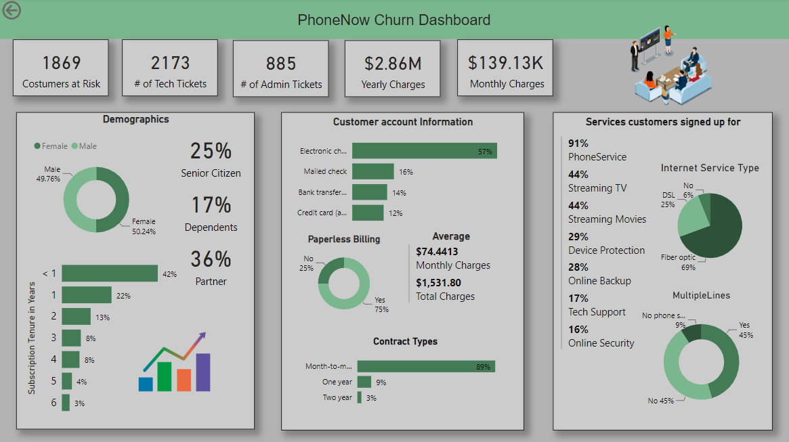
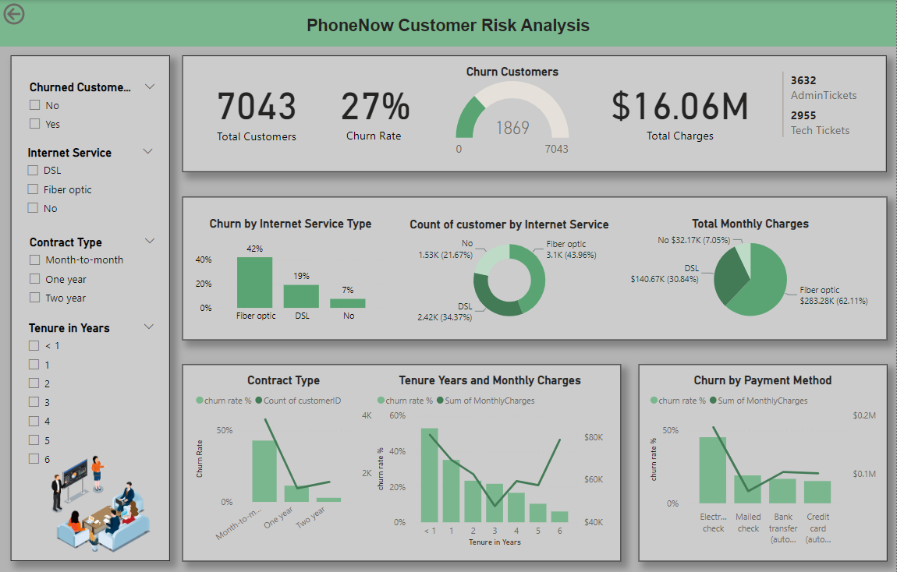

# Call-center-Customer-Retention

## About Project 👨‍💻

PhoneNow Call center Retention Manager has requested a dashboard that can generate informative data on Churn customers. 

## Problem Statement

The retention department wants to get customers back in case of termination. Currently, they get in touch after they have terminated the contract, but this is reactionary. They want to know in advance who is at risk. 

## Technologies used ⚙️

* Power BI
* DAX
* MS Excel

## Data Cleaning

* Transformed and processed client’s data by using DAX and Excel to ensure data completeness and validity
* Performed data cleaning to handle missing values.

## Data Visualisation in Power BI

### Churn Dashboard

### Customer Risk Analysis

## Findings

* Increase tech support capacity for Fiber Optic customers 
* lower tech tickets per customer to 0.5
* Increase sale of 1 and 2 year contracts by 5% each
* Yearly increase of automatic payments by 5%
